# 药店管理系统(文末获取方式☟)
> 
#### 介绍
药店管理系统
有BUG可留言加微

#### 软件架构
Java + SpringBoot + Mybatis/Mybatis-plus + Mysql

#### 项目功能说明

> + 促销管理：零售出库、零售退货
> + 采购管理：采购订单、采购入库、采购退货
> + 销售管理：销售订单、物流信息、销售退货
> + 仓库管理：其它入库、其它出库、调拨出库、组装单、拆卸单
> + 成本核算：收入单、支出单、收款单、付款单、转账单、收预付款
> + 药品溯源：库存状况、账户统计、进货统计、销售统计、入库明细、出库明细、入库汇总、出库汇总、客户对账、供应商对账、库存预警
> + 药品管理：药品类别、药品信息、计量单位、序列号
> + 基本资料：供应商信息、客户信息、会员信息、仓库信息、收支项目、结算账户、经手人管理
> + 系统管理：角色管理、功能管理、机构管理、用户管理、日志管理、系统配置、商品属性、插件管理

### 部分功能演示

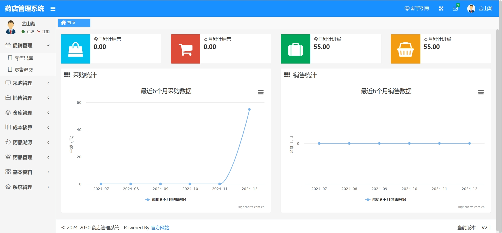
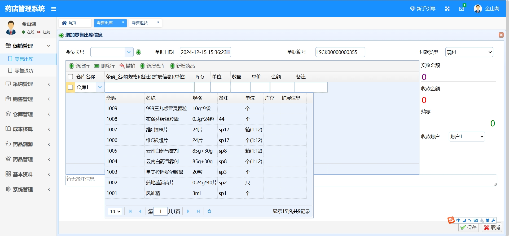
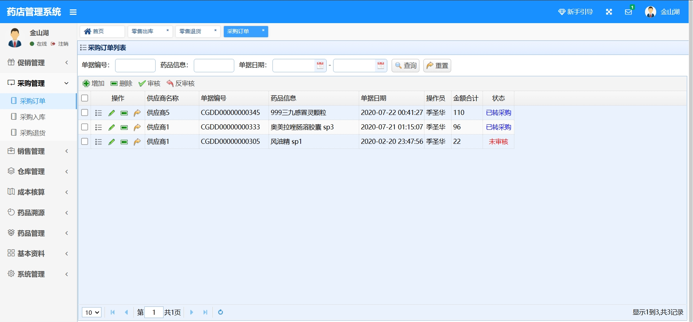
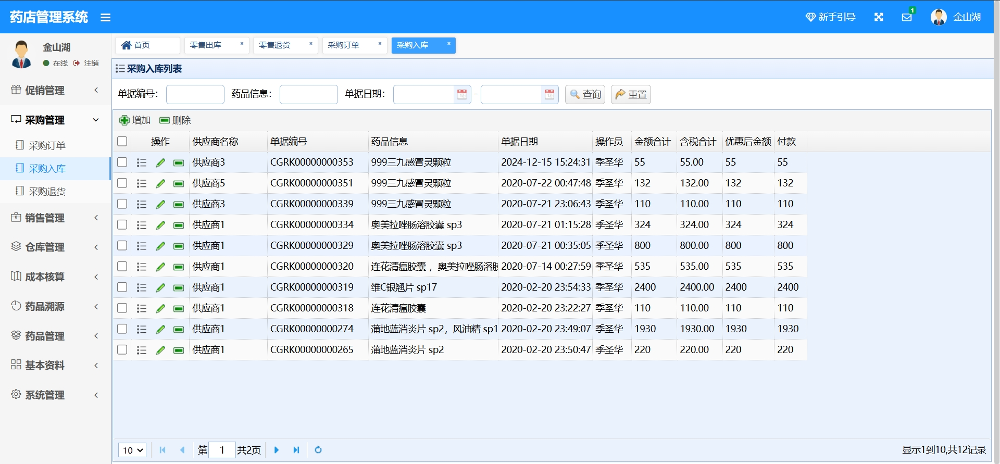
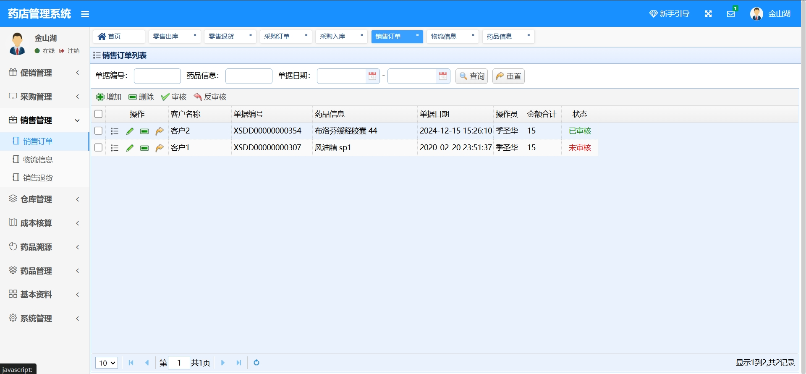
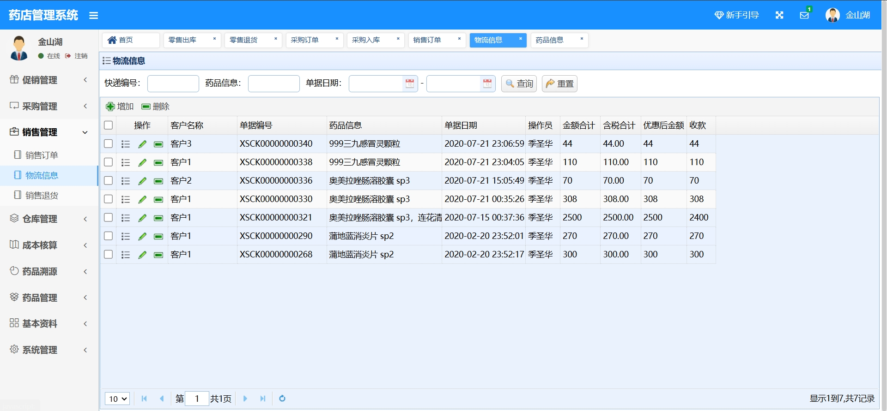
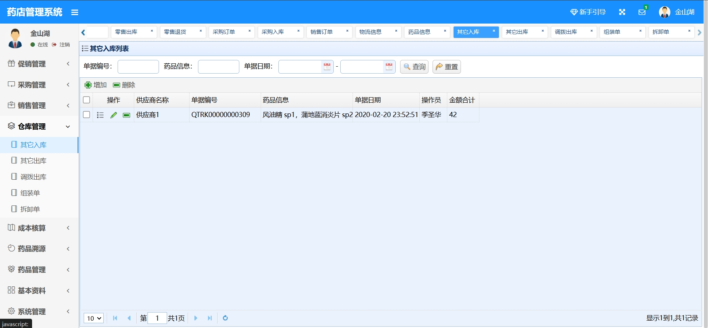
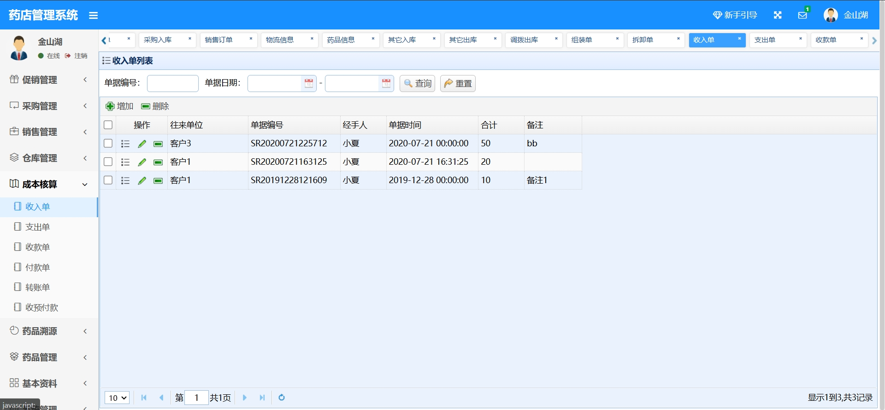
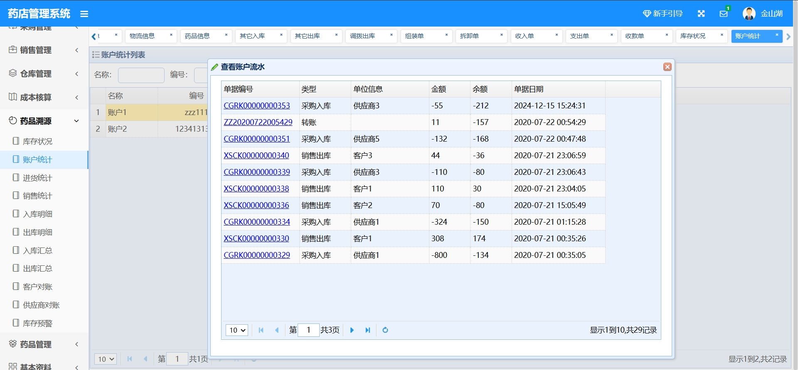
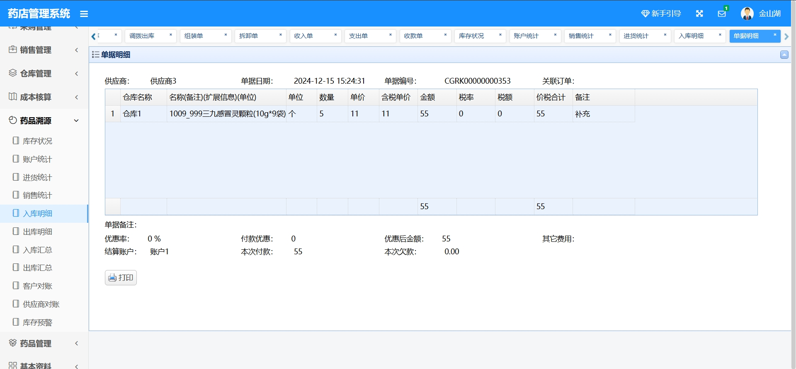
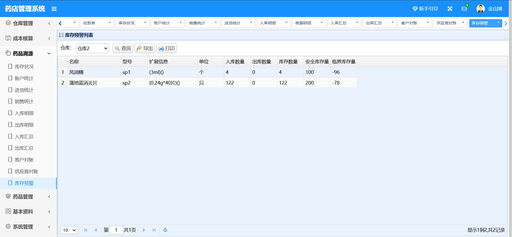
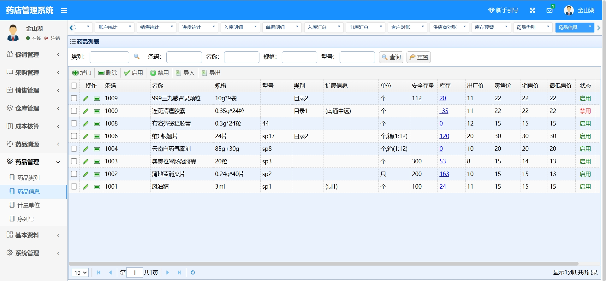
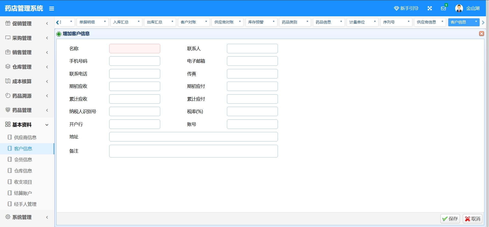
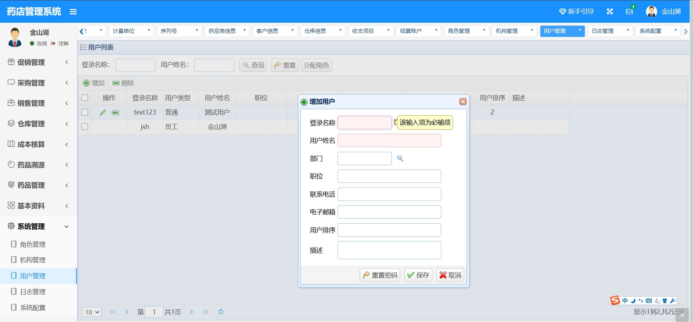

### 环境需求(可免费提供)
- idea/eclipse、jdk-1.8、maven-3.8.6、mysql、nodejs等

## 有项目修改、安装调试需求 请联系以下

## 获取资源扫☝☝☝
